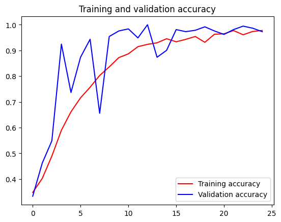

```python
!wget --no-check-certificate https://storage.googleapis.com/learning-datasets/rps.zip
  
!wget --no-check-certificate https://storage.googleapis.com/learning-datasets/rps-test-set.zip

```

    --2024-06-07 06:12:51--  https://storage.googleapis.com/learning-datasets/rps.zip
    Resolving storage.googleapis.com (storage.googleapis.com)... 216.58.214.27, 142.250.179.155, 142.251.36.59, ...
    Connecting to storage.googleapis.com (storage.googleapis.com)|216.58.214.27|:443... connected.
    HTTP request sent, awaiting response... 

    200 OK
    Length: 200682221 (191M) [application/zip]
    Saving to: ‘rps.zip’
    
    rps.zip             100%[===================>] 191.38M  27.2MB/s    in 7.0s    
    
    2024-06-07 06:12:59 (27.3 MB/s) - ‘rps.zip’ saved [200682221/200682221]
    
    --2024-06-07 06:12:59--  https://storage.googleapis.com/learning-datasets/rps-test-set.zip
    Resolving storage.googleapis.com (storage.googleapis.com)... 142.251.39.123, 142.251.36.59, 142.250.179.219, ...
    Connecting to storage.googleapis.com (storage.googleapis.com)|142.251.39.123|:443... connected.
    HTTP request sent, awaiting response... 200 OK
    Length: 29516758 (28M) [application/zip]
    Saving to: ‘rps-test-set.zip’
    
    rps-test-set.zip    100%[===================>]  28.15M  19.6MB/s    in 1.4s    
    
    2024-06-07 06:13:01 (19.6 MB/s) - ‘rps-test-set.zip’ saved [29516758/29516758]
    
    


```python
import os
import zipfile

local_zip = 'rps.zip'
zip_ref = zipfile.ZipFile(local_zip, 'r')
zip_ref.extractall('D:/mldownload/')
zip_ref.close()

local_zip = 'rps-test-set.zip'
zip_ref = zipfile.ZipFile(local_zip, 'r')
zip_ref.extractall('D:/mldownload/')
zip_ref.close()

```


```python
rock_dir = os.path.join('D:/mldownload/rps/rock')
paper_dir = os.path.join('D:/mldownload/rps/paper')
scissors_dir = os.path.join('D:/mldownload/rps/scissors')

print('total training rock images:', len(os.listdir(rock_dir)))
print('total training paper images:', len(os.listdir(paper_dir)))
print('total training scissors images:', len(os.listdir(scissors_dir)))

rock_files = os.listdir(rock_dir)
print(rock_files[:10])

paper_files = os.listdir(paper_dir)
print(paper_files[:10])

scissors_files = os.listdir(scissors_dir)
print(scissors_files[:10])

```

    total training rock images: 840
    total training paper images: 840
    total training scissors images: 840
    ['rock05ck01-046.png', 'rock04-101.png', 'rock01-031.png', 'rock02-050.png', 'rock04-089.png', 'rock05ck01-013.png', 'rock02-097.png', 'rock02-029.png', 'rock07-k03-033.png', 'rock01-020.png']
    ['paper05-099.png', 'paper02-109.png', 'paper03-054.png', 'paper01-054.png', 'paper03-089.png', 'paper05-105.png', 'paper03-038.png', 'paper06-113.png', 'paper04-055.png', 'paper02-019.png']
    ['testscissors03-114.png', 'testscissors03-008.png', 'scissors03-037.png', 'testscissors01-053.png', 'scissors02-028.png', 'testscissors02-112.png', 'scissors04-109.png', 'testscissors03-096.png', 'scissors03-068.png', 'scissors02-051.png']
    


```python
pip install matplotlib -i https://pypi.tuna.tsinghua.edu.cn/simple --trusted-host pypi.tuna.tsinghua.edu.cn 

```

    Looking in indexes: https://pypi.tuna.tsinghua.edu.cn/simple
    Collecting matplotlib
      Downloading https://pypi.tuna.tsinghua.edu.cn/packages/30/33/cc27211d2ffeee4fd7402dca137b6e8a83f6dcae3d4be8d0ad5068555561/matplotlib-3.7.5-cp38-cp38-manylinux_2_12_x86_64.manylinux2010_x86_64.whl (9.2 MB)
         ━━━━━━━━━━━━━━━━━━━━━━━━━━━━━━━━━━━━━━━━ 9.2/9.2 MB 6.3 MB/s eta 0:00:0000:0100:01
    [?25hCollecting contourpy>=1.0.1 (from matplotlib)
      Downloading https://pypi.tuna.tsinghua.edu.cn/packages/8e/71/7f20855592cc929bc206810432b991ec4c702dc26b0567b132e52c85536f/contourpy-1.1.1-cp38-cp38-manylinux_2_17_x86_64.manylinux2014_x86_64.whl (301 kB)
         ━━━━━━━━━━━━━━━━━━━━━━━━━━━━━━━━━━━━━━━ 301.1/301.1 kB 8.3 MB/s eta 0:00:0000:01
    [?25hCollecting cycler>=0.10 (from matplotlib)
      Downloading https://pypi.tuna.tsinghua.edu.cn/packages/e7/05/c19819d5e3d95294a6f5947fb9b9629efb316b96de511b418c53d245aae6/cycler-0.12.1-py3-none-any.whl (8.3 kB)
    Collecting fonttools>=4.22.0 (from matplotlib)
      Downloading https://pypi.tuna.tsinghua.edu.cn/packages/f3/0e/4d144e4cb8193b0cd8743ee2ac24e87ed952cebaede0da349b2a9d2fe222/fonttools-4.53.0-cp38-cp38-manylinux_2_17_x86_64.manylinux2014_x86_64.whl (4.7 MB)
         ━━━━━━━━━━━━━━━━━━━━━━━━━━━━━━━━━━━━━━━━ 4.7/4.7 MB 11.1 MB/s eta 0:00:0000:0100:01
    [?25hCollecting kiwisolver>=1.0.1 (from matplotlib)
      Downloading https://pypi.tuna.tsinghua.edu.cn/packages/d2/55/7021ffcc8cb26a520bb051aa0a3d08daf200cde945e5863d5768161e2d3d/kiwisolver-1.4.5-cp38-cp38-manylinux_2_5_x86_64.manylinux1_x86_64.whl (1.2 MB)
         ━━━━━━━━━━━━━━━━━━━━━━━━━━━━━━━━━━━━━━━━ 1.2/1.2 MB 18.1 MB/s eta 0:00:0000:01
    [?25hCollecting numpy<2,>=1.20 (from matplotlib)
      Downloading https://pypi.tuna.tsinghua.edu.cn/packages/98/5d/5738903efe0ecb73e51eb44feafba32bdba2081263d40c5043568ff60faf/numpy-1.24.4-cp38-cp38-manylinux_2_17_x86_64.manylinux2014_x86_64.whl (17.3 MB)
         ━━━━━━━━━━━━━━━━━━━━━━━━━━━━━━━━━━━━━━━━ 17.3/17.3 MB 9.1 MB/s eta 0:00:00:00:010:01m
    [?25hRequirement already satisfied: packaging>=20.0 in /workspaces/Androidexam-21-041/.conda/lib/python3.8/site-packages (from matplotlib) (24.0)
    Collecting pillow>=6.2.0 (from matplotlib)
      Downloading https://pypi.tuna.tsinghua.edu.cn/packages/63/c3/1ed3472168c4f884356cc995b7a82772f19a96accf6fa625bad1ce9c0cdf/pillow-10.3.0-cp38-cp38-manylinux_2_28_x86_64.whl (4.5 MB)
         ━━━━━━━━━━━━━━━━━━━━━━━━━━━━━━━━━━━━━━━━ 4.5/4.5 MB 10.5 MB/s eta 0:00:0000:0100:01
    [?25hCollecting pyparsing>=2.3.1 (from matplotlib)
      Downloading https://pypi.tuna.tsinghua.edu.cn/packages/9d/ea/6d76df31432a0e6fdf81681a895f009a4bb47b3c39036db3e1b528191d52/pyparsing-3.1.2-py3-none-any.whl (103 kB)
         ━━━━━━━━━━━━━━━━━━━━━━━━━━━━━━━━━━━━━━━ 103.2/103.2 kB 3.2 MB/s eta 0:00:00
    [?25hRequirement already satisfied: python-dateutil>=2.7 in /workspaces/Androidexam-21-041/.conda/lib/python3.8/site-packages (from matplotlib) (2.9.0)
    Collecting importlib-resources>=3.2.0 (from matplotlib)
      Downloading https://pypi.tuna.tsinghua.edu.cn/packages/75/06/4df55e1b7b112d183f65db9503bff189e97179b256e1ea450a3c365241e0/importlib_resources-6.4.0-py3-none-any.whl (38 kB)
    Requirement already satisfied: zipp>=3.1.0 in /workspaces/Androidexam-21-041/.conda/lib/python3.8/site-packages (from importlib-resources>=3.2.0->matplotlib) (3.17.0)
    Requirement already satisfied: six>=1.5 in /workspaces/Androidexam-21-041/.conda/lib/python3.8/site-packages (from python-dateutil>=2.7->matplotlib) (1.16.0)
    Installing collected packages: pyparsing, pillow, numpy, kiwisolver, importlib-resources, fonttools, cycler, contourpy, matplotlib
    Successfully installed contourpy-1.1.1 cycler-0.12.1 fonttools-4.53.0 importlib-resources-6.4.0 kiwisolver-1.4.5 matplotlib-3.7.5 numpy-1.24.4 pillow-10.3.0 pyparsing-3.1.2
    Note: you may need to restart the kernel to use updated packages.
    


```python
!pip install tflite-model-maker
```

    Collecting tflite-model-maker
      Downloading tflite_model_maker-0.4.3-py3-none-any.whl.metadata (5.4 kB)
    Collecting tf-models-official==2.3.0 (from tflite-model-maker)
      Downloading tf_models_official-2.3.0-py2.py3-none-any.whl.metadata (1.3 kB)
    Collecting numpy<1.23.4,>=1.17.3 (from tflite-model-maker)
      Downloading numpy-1.23.3-cp38-cp38-manylinux_2_17_x86_64.manylinux2014_x86_64.whl.metadata (2.3 kB)
    Requirement already satisfied: pillow>=7.0.0 in /workspaces/Androidexam-21-041/.conda/lib/python3.8/site-packages (from tflite-model-maker) (10.3.0)
    Collecting sentencepiece>=0.1.91 (from tflite-model-maker)
      Downloading sentencepiece-0.2.0-cp38-cp38-manylinux_2_17_x86_64.manylinux2014_x86_64.whl.metadata (7.7 kB)
    Collecting tensorflow-datasets>=2.1.0 (from tflite-model-maker)
      Downloading tensorflow_datasets-4.9.2-py3-none-any.whl.metadata (9.0 kB)
    Collecting fire>=0.3.1 (from tflite-model-maker)
      Downloading fire-0.6.0.tar.gz (88 kB)
         ━━━━━━━━━━━━━━━━━━━━━━━━━━━━━━━━━━━━━━━━ 88.4/88.4 kB 2.6 MB/s eta 0:00:00
    [?25h  Preparing metadata (setup.py) ... [?25ldone
    [?25hCollecting flatbuffers>=2.0 (from tflite-model-maker)
      Downloading flatbuffers-24.3.25-py2.py3-none-any.whl.metadata (850 bytes)
    Collecting absl-py>=0.10.0 (from tflite-model-maker)
      Downloading absl_py-2.1.0-py3-none-any.whl.metadata (2.3 kB)
    Collecting urllib3!=1.25.0,!=1.25.1,<1.26,>=1.21.1 (from tflite-model-maker)
      Downloading urllib3-1.25.11-py2.py3-none-any.whl.metadata (41 kB)
         ━━━━━━━━━━━━━━━━━━━━━━━━━━━━━━━━━━━━━━━━ 41.1/41.1 kB 1.1 MB/s eta 0:00:00
    [?25hCollecting tflite-support>=0.4.2 (from tflite-model-maker)
      Downloading tflite_support-0.4.3-cp38-cp38-manylinux2014_x86_64.whl.metadata (2.4 kB)
    Collecting tensorflowjs<3.19.0,>=2.4.0 (from tflite-model-maker)
      Downloading tensorflowjs-3.18.0-py3-none-any.whl.metadata (1.6 kB)
    Collecting tensorflow>=2.6.0 (from tflite-model-maker)
      Downloading tensorflow-2.13.1-cp38-cp38-manylinux_2_17_x86_64.manylinux2014_x86_64.whl.metadata (3.4 kB)
    Collecting numba>=0.53 (from tflite-model-maker)
      Downloading numba-0.58.1-cp38-cp38-manylinux2014_x86_64.manylinux_2_17_x86_64.whl.metadata (2.7 kB)
    Collecting librosa==0.8.1 (from tflite-model-maker)
      Downloading librosa-0.8.1-py3-none-any.whl.metadata (6.8 kB)
    Collecting lxml>=4.6.1 (from tflite-model-maker)
      Downloading lxml-5.2.2-cp38-cp38-manylinux_2_28_x86_64.whl.metadata (3.4 kB)
    Collecting PyYAML>=5.1 (from tflite-model-maker)
      Downloading PyYAML-6.0.1-cp38-cp38-manylinux_2_17_x86_64.manylinux2014_x86_64.whl.metadata (2.1 kB)
    Collecting matplotlib<3.5.0,>=3.0.3 (from tflite-model-maker)
      Downloading matplotlib-3.4.3-cp38-cp38-manylinux1_x86_64.whl.metadata (5.7 kB)
    Requirement already satisfied: six>=1.12.0 in /workspaces/Androidexam-21-041/.conda/lib/python3.8/site-packages (from tflite-model-maker) (1.16.0)
    Collecting tensorflow-addons>=0.11.2 (from tflite-model-maker)
      Downloading tensorflow_addons-0.21.0-cp38-cp38-manylinux_2_17_x86_64.manylinux2014_x86_64.whl.metadata (1.8 kB)
    Collecting neural-structured-learning>=1.3.1 (from tflite-model-maker)
      Downloading neural_structured_learning-1.4.0-py2.py3-none-any.whl.metadata (2.5 kB)
    Collecting tensorflow-model-optimization>=0.5 (from tflite-model-maker)
      Downloading tensorflow_model_optimization-0.8.0-py2.py3-none-any.whl.metadata (904 bytes)
    Collecting Cython>=0.29.13 (from tflite-model-maker)
      Downloading Cython-3.0.10-cp38-cp38-manylinux_2_17_x86_64.manylinux2014_x86_64.whl.metadata (3.2 kB)
    Collecting scann==1.2.6 (from tflite-model-maker)
      Downloading scann-1.2.6-cp38-cp38-manylinux2014_x86_64.whl.metadata (4.5 kB)
    Collecting tensorflow-hub<0.13,>=0.7.0 (from tflite-model-maker)
      Downloading tensorflow_hub-0.12.0-py2.py3-none-any.whl.metadata (1.7 kB)
    Collecting audioread>=2.0.0 (from librosa==0.8.1->tflite-model-maker)
      Downloading audioread-3.0.1-py3-none-any.whl.metadata (8.4 kB)
    Collecting scipy>=1.0.0 (from librosa==0.8.1->tflite-model-maker)
      Downloading scipy-1.10.1-cp38-cp38-manylinux_2_17_x86_64.manylinux2014_x86_64.whl.metadata (58 kB)
         ━━━━━━━━━━━━━━━━━━━━━━━━━━━━━━━━━━━━━━━━ 58.9/58.9 kB 1.8 MB/s eta 0:00:00
    [?25hCollecting scikit-learn!=0.19.0,>=0.14.0 (from librosa==0.8.1->tflite-model-maker)
      Downloading scikit_learn-1.3.2-cp38-cp38-manylinux_2_17_x86_64.manylinux2014_x86_64.whl.metadata (11 kB)
    Collecting joblib>=0.14 (from librosa==0.8.1->tflite-model-maker)
      Downloading joblib-1.4.2-py3-none-any.whl.metadata (5.4 kB)
    Requirement already satisfied: decorator>=3.0.0 in /workspaces/Androidexam-21-041/.conda/lib/python3.8/site-packages (from librosa==0.8.1->tflite-model-maker) (5.1.1)
    Collecting resampy>=0.2.2 (from librosa==0.8.1->tflite-model-maker)
      Downloading resampy-0.4.3-py3-none-any.whl.metadata (3.0 kB)
    Collecting soundfile>=0.10.2 (from librosa==0.8.1->tflite-model-maker)
      Downloading soundfile-0.12.1-py2.py3-none-manylinux_2_31_x86_64.whl.metadata (14 kB)
    Collecting pooch>=1.0 (from librosa==0.8.1->tflite-model-maker)
      Downloading pooch-1.8.2-py3-none-any.whl.metadata (10 kB)
    Requirement already satisfied: packaging>=20.0 in /workspaces/Androidexam-21-041/.conda/lib/python3.8/site-packages (from librosa==0.8.1->tflite-model-maker) (24.0)
    Collecting tensorflow>=2.6.0 (from tflite-model-maker)
      Downloading tensorflow-2.8.4-cp38-cp38-manylinux2010_x86_64.whl.metadata (2.9 kB)
    Collecting dataclasses (from tf-models-official==2.3.0->tflite-model-maker)
      Downloading dataclasses-0.6-py3-none-any.whl.metadata (3.0 kB)
    Collecting gin-config (from tf-models-official==2.3.0->tflite-model-maker)
      Downloading gin_config-0.5.0-py3-none-any.whl.metadata (2.9 kB)
    Collecting google-api-python-client>=1.6.7 (from tf-models-official==2.3.0->tflite-model-maker)
      Downloading google_api_python_client-2.132.0-py2.py3-none-any.whl.metadata (6.7 kB)
    Collecting google-cloud-bigquery>=0.31.0 (from tf-models-official==2.3.0->tflite-model-maker)
      Downloading google_cloud_bigquery-3.24.0-py2.py3-none-any.whl.metadata (8.9 kB)
    Collecting kaggle>=1.3.9 (from tf-models-official==2.3.0->tflite-model-maker)
      Downloading kaggle-1.6.14.tar.gz (82 kB)
         ━━━━━━━━━━━━━━━━━━━━━━━━━━━━━━━━━━━━━━━━ 82.1/82.1 kB 2.5 MB/s eta 0:00:00
    [?25h  Preparing metadata (setup.py) ... [?25ldone
    [?25hCollecting opencv-python-headless (from tf-models-official==2.3.0->tflite-model-maker)
      Downloading opencv_python_headless-4.10.0.82-cp37-abi3-manylinux_2_17_x86_64.manylinux2014_x86_64.whl.metadata (20 kB)
    Collecting pandas>=0.22.0 (from tf-models-official==2.3.0->tflite-model-maker)
      Downloading pandas-2.0.3-cp38-cp38-manylinux_2_17_x86_64.manylinux2014_x86_64.whl.metadata (18 kB)
    Requirement already satisfied: psutil>=5.4.3 in /workspaces/Androidexam-21-041/.conda/lib/python3.8/site-packages (from tf-models-official==2.3.0->tflite-model-maker) (5.9.8)
    Collecting py-cpuinfo>=3.3.0 (from tf-models-official==2.3.0->tflite-model-maker)
      Downloading py_cpuinfo-9.0.0-py3-none-any.whl.metadata (794 bytes)
    Collecting tf-slim>=1.1.0 (from tf-models-official==2.3.0->tflite-model-maker)
      Downloading tf_slim-1.1.0-py2.py3-none-any.whl.metadata (1.6 kB)
    Collecting termcolor (from fire>=0.3.1->tflite-model-maker)
      Downloading termcolor-2.4.0-py3-none-any.whl.metadata (6.1 kB)
    Requirement already satisfied: cycler>=0.10 in /workspaces/Androidexam-21-041/.conda/lib/python3.8/site-packages (from matplotlib<3.5.0,>=3.0.3->tflite-model-maker) (0.12.1)
    Requirement already satisfied: kiwisolver>=1.0.1 in /workspaces/Androidexam-21-041/.conda/lib/python3.8/site-packages (from matplotlib<3.5.0,>=3.0.3->tflite-model-maker) (1.4.5)
    Requirement already satisfied: pyparsing>=2.2.1 in /workspaces/Androidexam-21-041/.conda/lib/python3.8/site-packages (from matplotlib<3.5.0,>=3.0.3->tflite-model-maker) (3.1.2)
    Requirement already satisfied: python-dateutil>=2.7 in /workspaces/Androidexam-21-041/.conda/lib/python3.8/site-packages (from matplotlib<3.5.0,>=3.0.3->tflite-model-maker) (2.9.0)
    Collecting attrs (from neural-structured-learning>=1.3.1->tflite-model-maker)
      Downloading attrs-23.2.0-py3-none-any.whl.metadata (9.5 kB)
    Collecting llvmlite<0.42,>=0.41.0dev0 (from numba>=0.53->tflite-model-maker)
      Downloading llvmlite-0.41.1-cp38-cp38-manylinux_2_17_x86_64.manylinux2014_x86_64.whl.metadata (4.8 kB)
    Requirement already satisfied: importlib-metadata in /workspaces/Androidexam-21-041/.conda/lib/python3.8/site-packages (from numba>=0.53->tflite-model-maker) (7.1.0)
    Collecting astunparse>=1.6.0 (from tensorflow>=2.6.0->tflite-model-maker)
      Downloading astunparse-1.6.3-py2.py3-none-any.whl.metadata (4.4 kB)
    Collecting gast>=0.2.1 (from tensorflow>=2.6.0->tflite-model-maker)
      Downloading gast-0.5.4-py3-none-any.whl.metadata (1.3 kB)
    Collecting google-pasta>=0.1.1 (from tensorflow>=2.6.0->tflite-model-maker)
      Downloading google_pasta-0.2.0-py3-none-any.whl.metadata (814 bytes)
    Collecting h5py>=2.9.0 (from tensorflow>=2.6.0->tflite-model-maker)
      Downloading h5py-3.11.0-cp38-cp38-manylinux_2_17_x86_64.manylinux2014_x86_64.whl.metadata (2.5 kB)
    Collecting keras-preprocessing>=1.1.1 (from tensorflow>=2.6.0->tflite-model-maker)
      Downloading Keras_Preprocessing-1.1.2-py2.py3-none-any.whl.metadata (1.9 kB)
    Collecting libclang>=9.0.1 (from tensorflow>=2.6.0->tflite-model-maker)
      Downloading libclang-18.1.1-py2.py3-none-manylinux2010_x86_64.whl.metadata (5.2 kB)
    Collecting opt-einsum>=2.3.2 (from tensorflow>=2.6.0->tflite-model-maker)
      Downloading opt_einsum-3.3.0-py3-none-any.whl.metadata (6.5 kB)
    Collecting protobuf<3.20,>=3.9.2 (from tensorflow>=2.6.0->tflite-model-maker)
      Downloading protobuf-3.19.6-cp38-cp38-manylinux_2_17_x86_64.manylinux2014_x86_64.whl.metadata (787 bytes)
    Requirement already satisfied: setuptools in /workspaces/Androidexam-21-041/.conda/lib/python3.8/site-packages (from tensorflow>=2.6.0->tflite-model-maker) (69.5.1)
    Requirement already satisfied: typing-extensions>=3.6.6 in /workspaces/Androidexam-21-041/.conda/lib/python3.8/site-packages (from tensorflow>=2.6.0->tflite-model-maker) (4.12.1)
    Collecting wrapt>=1.11.0 (from tensorflow>=2.6.0->tflite-model-maker)
      Downloading wrapt-1.16.0-cp38-cp38-manylinux_2_5_x86_64.manylinux1_x86_64.manylinux_2_17_x86_64.manylinux2014_x86_64.whl.metadata (6.6 kB)
    Collecting tensorboard<2.9,>=2.8 (from tensorflow>=2.6.0->tflite-model-maker)
      Downloading tensorboard-2.8.0-py3-none-any.whl.metadata (1.9 kB)
    Collecting tensorflow-estimator<2.9,>=2.8 (from tensorflow>=2.6.0->tflite-model-maker)
      Downloading tensorflow_estimator-2.8.0-py2.py3-none-any.whl.metadata (1.3 kB)
    Collecting keras<2.9,>=2.8.0rc0 (from tensorflow>=2.6.0->tflite-model-maker)
      Downloading keras-2.8.0-py2.py3-none-any.whl.metadata (1.3 kB)
    Collecting tensorflow-io-gcs-filesystem>=0.23.1 (from tensorflow>=2.6.0->tflite-model-maker)
      Downloading tensorflow_io_gcs_filesystem-0.34.0-cp38-cp38-manylinux_2_12_x86_64.manylinux2010_x86_64.whl.metadata (14 kB)
    Collecting grpcio<2.0,>=1.24.3 (from tensorflow>=2.6.0->tflite-model-maker)
      Downloading grpcio-1.64.1-cp38-cp38-manylinux_2_17_x86_64.manylinux2014_x86_64.whl.metadata (3.3 kB)
    Collecting typeguard<3.0.0,>=2.7 (from tensorflow-addons>=0.11.2->tflite-model-maker)
      Downloading typeguard-2.13.3-py3-none-any.whl.metadata (3.6 kB)
    Collecting array-record (from tensorflow-datasets>=2.1.0->tflite-model-maker)
      Downloading array_record-0.4.0-py38-none-any.whl.metadata (502 bytes)
    Collecting click (from tensorflow-datasets>=2.1.0->tflite-model-maker)
      Downloading click-8.1.7-py3-none-any.whl.metadata (3.0 kB)
    Collecting dm-tree (from tensorflow-datasets>=2.1.0->tflite-model-maker)
      Downloading dm_tree-0.1.8-cp38-cp38-manylinux_2_17_x86_64.manylinux2014_x86_64.whl.metadata (1.9 kB)
    Collecting etils>=0.9.0 (from etils[enp,epath]>=0.9.0->tensorflow-datasets>=2.1.0->tflite-model-maker)
      Downloading etils-1.3.0-py3-none-any.whl.metadata (5.5 kB)
    Collecting promise (from tensorflow-datasets>=2.1.0->tflite-model-maker)
      Downloading promise-2.3.tar.gz (19 kB)
      Preparing metadata (setup.py) ... [?25ldone
    [?25hINFO: pip is looking at multiple versions of tensorflow-datasets to determine which version is compatible with other requirements. This could take a while.
    Collecting tensorflow-datasets>=2.1.0 (from tflite-model-maker)
      Downloading tensorflow_datasets-4.9.1-py3-none-any.whl.metadata (9.0 kB)
      Downloading tensorflow_datasets-4.9.0-py3-none-any.whl.metadata (9.0 kB)
    Collecting requests>=2.19.0 (from tensorflow-datasets>=2.1.0->tflite-model-maker)
      Downloading requests-2.32.3-py3-none-any.whl.metadata (4.6 kB)
    Collecting tensorflow-metadata (from tensorflow-datasets>=2.1.0->tflite-model-maker)
      Downloading tensorflow_metadata-1.14.0-py3-none-any.whl.metadata (2.1 kB)
    Collecting toml (from tensorflow-datasets>=2.1.0->tflite-model-maker)
      Downloading toml-0.10.2-py2.py3-none-any.whl.metadata (7.1 kB)
    Collecting tqdm (from tensorflow-datasets>=2.1.0->tflite-model-maker)
      Downloading tqdm-4.66.4-py3-none-any.whl.metadata (57 kB)
         ━━━━━━━━━━━━━━━━━━━━━━━━━━━━━━━━━━━━━━━━ 57.6/57.6 kB 1.8 MB/s eta 0:00:00
    [?25hRequirement already satisfied: importlib-resources in /workspaces/Androidexam-21-041/.conda/lib/python3.8/site-packages (from tensorflow-datasets>=2.1.0->tflite-model-maker) (6.4.0)
    Collecting absl-py>=0.10.0 (from tflite-model-maker)
      Downloading absl_py-1.4.0-py3-none-any.whl.metadata (2.3 kB)
    Collecting packaging>=20.0 (from librosa==0.8.1->tflite-model-maker)
      Downloading packaging-20.9-py2.py3-none-any.whl.metadata (13 kB)
    Collecting sounddevice>=0.4.4 (from tflite-support>=0.4.2->tflite-model-maker)
      Downloading sounddevice-0.4.7-py3-none-any.whl.metadata (1.4 kB)
    Collecting pybind11>=2.6.0 (from tflite-support>=0.4.2->tflite-model-maker)
      Downloading pybind11-2.12.0-py3-none-any.whl.metadata (9.5 kB)
    Requirement already satisfied: wheel<1.0,>=0.23.0 in /workspaces/Androidexam-21-041/.conda/lib/python3.8/site-packages (from astunparse>=1.6.0->tensorflow>=2.6.0->tflite-model-maker) (0.43.0)
    Requirement already satisfied: zipp in /workspaces/Androidexam-21-041/.conda/lib/python3.8/site-packages (from etils[enp,epath]>=0.9.0->tensorflow-datasets>=2.1.0->tflite-model-maker) (3.17.0)
    Collecting httplib2<1.dev0,>=0.19.0 (from google-api-python-client>=1.6.7->tf-models-official==2.3.0->tflite-model-maker)
      Downloading httplib2-0.22.0-py3-none-any.whl.metadata (2.6 kB)
    Collecting google-auth!=2.24.0,!=2.25.0,<3.0.0.dev0,>=1.32.0 (from google-api-python-client>=1.6.7->tf-models-official==2.3.0->tflite-model-maker)
      Downloading google_auth-2.30.0-py2.py3-none-any.whl.metadata (4.7 kB)
    Collecting google-auth-httplib2<1.0.0,>=0.2.0 (from google-api-python-client>=1.6.7->tf-models-official==2.3.0->tflite-model-maker)
      Downloading google_auth_httplib2-0.2.0-py2.py3-none-any.whl.metadata (2.2 kB)
    Collecting google-api-core!=2.0.*,!=2.1.*,!=2.2.*,!=2.3.0,<3.0.0.dev0,>=1.31.5 (from google-api-python-client>=1.6.7->tf-models-official==2.3.0->tflite-model-maker)
      Downloading google_api_core-2.19.0-py3-none-any.whl.metadata (2.7 kB)
    Collecting uritemplate<5,>=3.0.1 (from google-api-python-client>=1.6.7->tf-models-official==2.3.0->tflite-model-maker)
      Downloading uritemplate-4.1.1-py2.py3-none-any.whl.metadata (2.9 kB)
    Collecting google-cloud-core<3.0.0dev,>=1.6.0 (from google-cloud-bigquery>=0.31.0->tf-models-official==2.3.0->tflite-model-maker)
      Downloading google_cloud_core-2.4.1-py2.py3-none-any.whl.metadata (2.7 kB)
    Collecting google-resumable-media<3.0dev,>=0.6.0 (from google-cloud-bigquery>=0.31.0->tf-models-official==2.3.0->tflite-model-maker)
      Downloading google_resumable_media-2.7.0-py2.py3-none-any.whl.metadata (2.2 kB)
    Collecting certifi>=2023.7.22 (from kaggle>=1.3.9->tf-models-official==2.3.0->tflite-model-maker)
      Downloading certifi-2024.6.2-py3-none-any.whl.metadata (2.2 kB)
    Collecting python-slugify (from kaggle>=1.3.9->tf-models-official==2.3.0->tflite-model-maker)
      Downloading python_slugify-8.0.4-py2.py3-none-any.whl.metadata (8.5 kB)
    Collecting bleach (from kaggle>=1.3.9->tf-models-official==2.3.0->tflite-model-maker)
      Downloading bleach-6.1.0-py3-none-any.whl.metadata (30 kB)
    Collecting pytz>=2020.1 (from pandas>=0.22.0->tf-models-official==2.3.0->tflite-model-maker)
      Downloading pytz-2024.1-py2.py3-none-any.whl.metadata (22 kB)
    Collecting tzdata>=2022.1 (from pandas>=0.22.0->tf-models-official==2.3.0->tflite-model-maker)
      Downloading tzdata-2024.1-py2.py3-none-any.whl.metadata (1.4 kB)
    Requirement already satisfied: platformdirs>=2.5.0 in /workspaces/Androidexam-21-041/.conda/lib/python3.8/site-packages (from pooch>=1.0->librosa==0.8.1->tflite-model-maker) (4.2.2)
    Collecting charset-normalizer<4,>=2 (from requests>=2.19.0->tensorflow-datasets>=2.1.0->tflite-model-maker)
      Downloading charset_normalizer-3.3.2-cp38-cp38-manylinux_2_17_x86_64.manylinux2014_x86_64.whl.metadata (33 kB)
    Collecting idna<4,>=2.5 (from requests>=2.19.0->tensorflow-datasets>=2.1.0->tflite-model-maker)
      Downloading idna-3.7-py3-none-any.whl.metadata (9.9 kB)
    Collecting threadpoolctl>=2.0.0 (from scikit-learn!=0.19.0,>=0.14.0->librosa==0.8.1->tflite-model-maker)
      Downloading threadpoolctl-3.5.0-py3-none-any.whl.metadata (13 kB)
    Collecting CFFI>=1.0 (from sounddevice>=0.4.4->tflite-support>=0.4.2->tflite-model-maker)
      Downloading cffi-1.16.0-cp38-cp38-manylinux_2_17_x86_64.manylinux2014_x86_64.whl.metadata (1.5 kB)
    Collecting google-auth-oauthlib<0.5,>=0.4.1 (from tensorboard<2.9,>=2.8->tensorflow>=2.6.0->tflite-model-maker)
      Downloading google_auth_oauthlib-0.4.6-py2.py3-none-any.whl.metadata (2.7 kB)
    Collecting markdown>=2.6.8 (from tensorboard<2.9,>=2.8->tensorflow>=2.6.0->tflite-model-maker)
      Downloading Markdown-3.6-py3-none-any.whl.metadata (7.0 kB)
    Collecting tensorboard-data-server<0.7.0,>=0.6.0 (from tensorboard<2.9,>=2.8->tensorflow>=2.6.0->tflite-model-maker)
      Downloading tensorboard_data_server-0.6.1-py3-none-manylinux2010_x86_64.whl.metadata (1.1 kB)
    Collecting tensorboard-plugin-wit>=1.6.0 (from tensorboard<2.9,>=2.8->tensorflow>=2.6.0->tflite-model-maker)
      Downloading tensorboard_plugin_wit-1.8.1-py3-none-any.whl.metadata (873 bytes)
    Collecting werkzeug>=0.11.15 (from tensorboard<2.9,>=2.8->tensorflow>=2.6.0->tflite-model-maker)
      Downloading werkzeug-3.0.3-py3-none-any.whl.metadata (3.7 kB)
    Collecting googleapis-common-protos<2,>=1.52.0 (from tensorflow-metadata->tensorflow-datasets>=2.1.0->tflite-model-maker)
      Downloading googleapis_common_protos-1.63.1-py2.py3-none-any.whl.metadata (1.5 kB)
    INFO: pip is looking at multiple versions of tensorflow-metadata to determine which version is compatible with other requirements. This could take a while.
    Collecting tensorflow-metadata (from tensorflow-datasets>=2.1.0->tflite-model-maker)
      Downloading tensorflow_metadata-1.13.1-py3-none-any.whl.metadata (2.1 kB)
      Downloading tensorflow_metadata-1.13.0-py3-none-any.whl.metadata (2.1 kB)
    Collecting pycparser (from CFFI>=1.0->sounddevice>=0.4.4->tflite-support>=0.4.2->tflite-model-maker)
      Downloading pycparser-2.22-py3-none-any.whl.metadata (943 bytes)
    Collecting proto-plus<2.0.0dev,>=1.22.3 (from google-api-core!=2.0.*,!=2.1.*,!=2.2.*,!=2.3.0,<3.0.0.dev0,>=1.31.5->google-api-python-client>=1.6.7->tf-models-official==2.3.0->tflite-model-maker)
      Downloading proto_plus-1.23.0-py3-none-any.whl.metadata (2.2 kB)
    Collecting grpcio-status<2.0.dev0,>=1.33.2 (from google-api-core[grpc]!=2.0.*,!=2.1.*,!=2.10.*,!=2.2.*,!=2.3.*,!=2.4.*,!=2.5.*,!=2.6.*,!=2.7.*,!=2.8.*,!=2.9.*,<3.0.0dev,>=1.34.1->google-cloud-bigquery>=0.31.0->tf-models-official==2.3.0->tflite-model-maker)
      Downloading grpcio_status-1.64.1-py3-none-any.whl.metadata (1.1 kB)
    Collecting cachetools<6.0,>=2.0.0 (from google-auth!=2.24.0,!=2.25.0,<3.0.0.dev0,>=1.32.0->google-api-python-client>=1.6.7->tf-models-official==2.3.0->tflite-model-maker)
      Downloading cachetools-5.3.3-py3-none-any.whl.metadata (5.3 kB)
    Collecting pyasn1-modules>=0.2.1 (from google-auth!=2.24.0,!=2.25.0,<3.0.0.dev0,>=1.32.0->google-api-python-client>=1.6.7->tf-models-official==2.3.0->tflite-model-maker)
      Downloading pyasn1_modules-0.4.0-py3-none-any.whl.metadata (3.4 kB)
    Collecting rsa<5,>=3.1.4 (from google-auth!=2.24.0,!=2.25.0,<3.0.0.dev0,>=1.32.0->google-api-python-client>=1.6.7->tf-models-official==2.3.0->tflite-model-maker)
      Downloading rsa-4.9-py3-none-any.whl.metadata (4.2 kB)
    Collecting requests-oauthlib>=0.7.0 (from google-auth-oauthlib<0.5,>=0.4.1->tensorboard<2.9,>=2.8->tensorflow>=2.6.0->tflite-model-maker)
      Downloading requests_oauthlib-2.0.0-py2.py3-none-any.whl.metadata (11 kB)
    Collecting google-crc32c<2.0dev,>=1.0 (from google-resumable-media<3.0dev,>=0.6.0->google-cloud-bigquery>=0.31.0->tf-models-official==2.3.0->tflite-model-maker)
      Downloading google_crc32c-1.5.0-cp38-cp38-manylinux_2_17_x86_64.manylinux2014_x86_64.whl.metadata (2.3 kB)
    Collecting MarkupSafe>=2.1.1 (from werkzeug>=0.11.15->tensorboard<2.9,>=2.8->tensorflow>=2.6.0->tflite-model-maker)
      Downloading MarkupSafe-2.1.5-cp38-cp38-manylinux_2_17_x86_64.manylinux2014_x86_64.whl.metadata (3.0 kB)
    Collecting webencodings (from bleach->kaggle>=1.3.9->tf-models-official==2.3.0->tflite-model-maker)
      Downloading webencodings-0.5.1-py2.py3-none-any.whl.metadata (2.1 kB)
    Collecting text-unidecode>=1.3 (from python-slugify->kaggle>=1.3.9->tf-models-official==2.3.0->tflite-model-maker)
      Downloading text_unidecode-1.3-py2.py3-none-any.whl.metadata (2.4 kB)
    INFO: pip is looking at multiple versions of grpcio-status to determine which version is compatible with other requirements. This could take a while.
    Collecting grpcio-status<2.0.dev0,>=1.33.2 (from google-api-core[grpc]!=2.0.*,!=2.1.*,!=2.10.*,!=2.2.*,!=2.3.*,!=2.4.*,!=2.5.*,!=2.6.*,!=2.7.*,!=2.8.*,!=2.9.*,<3.0.0dev,>=1.34.1->google-cloud-bigquery>=0.31.0->tf-models-official==2.3.0->tflite-model-maker)
      Downloading grpcio_status-1.64.0-py3-none-any.whl.metadata (1.1 kB)
      Downloading grpcio_status-1.63.0-py3-none-any.whl.metadata (1.1 kB)
      Downloading grpcio_status-1.62.2-py3-none-any.whl.metadata (1.3 kB)
      Downloading grpcio_status-1.62.1-py3-none-any.whl.metadata (1.3 kB)
      Downloading grpcio_status-1.62.0-py3-none-any.whl.metadata (1.3 kB)
      Downloading grpcio_status-1.60.1-py3-none-any.whl.metadata (1.3 kB)
      Downloading grpcio_status-1.60.0-py3-none-any.whl.metadata (1.3 kB)
    INFO: pip is still looking at multiple versions of grpcio-status to determine which version is compatible with other requirements. This could take a while.
      Downloading grpcio_status-1.59.3-py3-none-any.whl.metadata (1.3 kB)
      Downloading grpcio_status-1.59.2-py3-none-any.whl.metadata (1.3 kB)
      Downloading grpcio_status-1.59.0-py3-none-any.whl.metadata (1.3 kB)
      Downloading grpcio_status-1.58.0-py3-none-any.whl.metadata (1.3 kB)
      Downloading grpcio_status-1.57.0-py3-none-any.whl.metadata (1.2 kB)
    INFO: This is taking longer than usual. You might need to provide the dependency resolver with stricter constraints to reduce runtime. See https://pip.pypa.io/warnings/backtracking for guidance. If you want to abort this run, press Ctrl + C.
      Downloading grpcio_status-1.56.2-py3-none-any.whl.metadata (1.3 kB)
      Downloading grpcio_status-1.56.0-py3-none-any.whl.metadata (1.3 kB)
      Downloading grpcio_status-1.55.3-py3-none-any.whl.metadata (1.3 kB)
      Downloading grpcio_status-1.54.3-py3-none-any.whl.metadata (1.3 kB)
      Downloading grpcio_status-1.54.2-py3-none-any.whl.metadata (1.3 kB)
      Downloading grpcio_status-1.54.0-py3-none-any.whl.metadata (1.3 kB)
      Downloading grpcio_status-1.53.2-py3-none-any.whl.metadata (1.3 kB)
      Downloading grpcio_status-1.53.1-py3-none-any.whl.metadata (1.3 kB)
      Downloading grpcio_status-1.53.0-py3-none-any.whl.metadata (1.3 kB)
      Downloading grpcio_status-1.51.3-py3-none-any.whl.metadata (1.3 kB)
      Downloading grpcio_status-1.51.1-py3-none-any.whl.metadata (1.3 kB)
      Downloading grpcio_status-1.50.0-py3-none-any.whl.metadata (1.3 kB)
      Downloading grpcio_status-1.49.1-py3-none-any.whl.metadata (1.3 kB)
      Downloading grpcio_status-1.48.2-py3-none-any.whl.metadata (1.2 kB)
    Collecting pyasn1<0.7.0,>=0.4.6 (from pyasn1-modules>=0.2.1->google-auth!=2.24.0,!=2.25.0,<3.0.0.dev0,>=1.32.0->google-api-python-client>=1.6.7->tf-models-official==2.3.0->tflite-model-maker)
      Downloading pyasn1-0.6.0-py2.py3-none-any.whl.metadata (8.3 kB)
    Collecting oauthlib>=3.0.0 (from requests-oauthlib>=0.7.0->google-auth-oauthlib<0.5,>=0.4.1->tensorboard<2.9,>=2.8->tensorflow>=2.6.0->tflite-model-maker)
      Downloading oauthlib-3.2.2-py3-none-any.whl.metadata (7.5 kB)
    Downloading tflite_model_maker-0.4.3-py3-none-any.whl (580 kB)
       ━━━━━━━━━━━━━━━━━━━━━━━━━━━━━━━━━━━━━━━━ 580.1/580.1 kB 13.2 MB/s eta 0:00:0000:01
    [?25hDownloading librosa-0.8.1-py3-none-any.whl (203 kB)
       ━━━━━━━━━━━━━━━━━━━━━━━━━━━━━━━━━━━━━━━━ 203.8/203.8 kB 6.2 MB/s eta 0:00:00
    [?25hDownloading scann-1.2.6-cp38-cp38-manylinux2014_x86_64.whl (10.9 MB)
       ━━━━━━━━━━━━━━━━━━━━━━━━━━━━━━━━━━━━━━━━ 10.9/10.9 MB 8.4 MB/s eta 0:00:0000:0100:01m
    [?25hDownloading tf_models_official-2.3.0-py2.py3-none-any.whl (840 kB)
       ━━━━━━━━━━━━━━━━━━━━━━━━━━━━━━━━━━━━━━━━ 840.9/840.9 kB 21.2 MB/s eta 0:00:0000:01
    [?25hDownloading Cython-3.0.10-cp38-cp38-manylinux_2_17_x86_64.manylinux2014_x86_64.whl (3.6 MB)
       ━━━━━━━━━━━━━━━━━━━━━━━━━━━━━━━━━━━━━━━━ 3.6/3.6 MB 50.1 MB/s eta 0:00:00:00:01
    [?25hDownloading flatbuffers-24.3.25-py2.py3-none-any.whl (26 kB)
    Downloading lxml-5.2.2-cp38-cp38-manylinux_2_28_x86_64.whl (5.1 MB)
       ━━━━━━━━━━━━━━━━━━━━━━━━━━━━━━━━━━━━━━━━ 5.1/5.1 MB 58.4 MB/s eta 0:00:00:00:01
    [?25hDownloading matplotlib-3.4.3-cp38-cp38-manylinux1_x86_64.whl (10.3 MB)
       ━━━━━━━━━━━━━━━━━━━━━━━━━━━━━━━━━━━━━━━━ 10.3/10.3 MB 67.6 MB/s eta 0:00:00:00:010:01
    [?25hDownloading neural_structured_learning-1.4.0-py2.py3-none-any.whl (128 kB)
       ━━━━━━━━━━━━━━━━━━━━━━━━━━━━━━━━━━━━━━━━ 128.6/128.6 kB 4.3 MB/s eta 0:00:00
    [?25hDownloading numba-0.58.1-cp38-cp38-manylinux2014_x86_64.manylinux_2_17_x86_64.whl (3.7 MB)
       ━━━━━━━━━━━━━━━━━━━━━━━━━━━━━━━━━━━━━━━━ 3.7/3.7 MB 46.0 MB/s eta 0:00:00:00:01
    [?25hDownloading numpy-1.23.3-cp38-cp38-manylinux_2_17_x86_64.manylinux2014_x86_64.whl (17.1 MB)
       ━━━━━━━━━━━━━━━━━━━━━━━━━━━━━━━━━━━━━━━━ 17.1/17.1 MB 45.0 MB/s eta 0:00:00:00:0100:01
    [?25hDownloading PyYAML-6.0.1-cp38-cp38-manylinux_2_17_x86_64.manylinux2014_x86_64.whl (736 kB)
       ━━━━━━━━━━━━━━━━━━━━━━━━━━━━━━━━━━━━━━━━ 736.6/736.6 kB 16.7 MB/s eta 0:00:0000:01
    [?25hDownloading sentencepiece-0.2.0-cp38-cp38-manylinux_2_17_x86_64.manylinux2014_x86_64.whl (1.3 MB)
       ━━━━━━━━━━━━━━━━━━━━━━━━━━━━━━━━━━━━━━━━ 1.3/1.3 MB 24.8 MB/s eta 0:00:00:00:01
    [?25hDownloading tensorflow-2.8.4-cp38-cp38-manylinux2010_x86_64.whl (498.0 MB)
       ━━━━━━━━━━━━━━━━━━━━━━━━━━━━━━━━━━━━━━━━ 498.0/498.0 MB 4.0 MB/s eta 0:00:00:00:0100:01
    [?25hDownloading tensorflow_addons-0.21.0-cp38-cp38-manylinux_2_17_x86_64.manylinux2014_x86_64.whl (612 kB)
       ━━━━━━━━━━━━━━━━━━━━━━━━━━━━━━━━━━━━━━━━ 612.0/612.0 kB 16.6 MB/s eta 0:00:0000:01
    [?25hDownloading tensorflow_datasets-4.9.0-py3-none-any.whl (5.4 MB)
       ━━━━━━━━━━━━━━━━━━━━━━━━━━━━━━━━━━━━━━━━ 5.4/5.4 MB 55.3 MB/s eta 0:00:00:00:01
    [?25hDownloading tensorflow_hub-0.12.0-py2.py3-none-any.whl (108 kB)
       ━━━━━━━━━━━━━━━━━━━━━━━━━━━━━━━━━━━━━━━━ 108.8/108.8 kB 3.6 MB/s eta 0:00:00
    [?25hDownloading tensorflow_model_optimization-0.8.0-py2.py3-none-any.whl (242 kB)
       ━━━━━━━━━━━━━━━━━━━━━━━━━━━━━━━━━━━━━━━━ 242.5/242.5 kB 8.0 MB/s eta 0:00:00
    [?25hDownloading absl_py-1.4.0-py3-none-any.whl (126 kB)
       ━━━━━━━━━━━━━━━━━━━━━━━━━━━━━━━━━━━━━━━━ 126.5/126.5 kB 4.2 MB/s eta 0:00:00
    [?25hDownloading tensorflowjs-3.18.0-py3-none-any.whl (77 kB)
       ━━━━━━━━━━━━━━━━━━━━━━━━━━━━━━━━━━━━━━━━ 77.5/77.5 kB 2.2 MB/s eta 0:00:00
    [?25hDownloading tflite_support-0.4.3-cp38-cp38-manylinux2014_x86_64.whl (60.8 MB)
       ━━━━━━━━━━━━━━━━━━━━━━━━━━━━━━━━━━━━━━━━ 60.8/60.8 MB 3.9 MB/s eta 0:00:0000:0100:01m
    [?25hDownloading urllib3-1.25.11-py2.py3-none-any.whl (127 kB)
       ━━━━━━━━━━━━━━━━━━━━━━━━━━━━━━━━━━━━━━━━ 128.0/128.0 kB 4.1 MB/s eta 0:00:00
    [?25hDownloading astunparse-1.6.3-py2.py3-none-any.whl (12 kB)
    Downloading audioread-3.0.1-py3-none-any.whl (23 kB)
    Downloading dm_tree-0.1.8-cp38-cp38-manylinux_2_17_x86_64.manylinux2014_x86_64.whl (152 kB)
       ━━━━━━━━━━━━━━━━━━━━━━━━━━━━━━━━━━━━━━━━ 152.9/152.9 kB 5.2 MB/s eta 0:00:00
    [?25hDownloading etils-1.3.0-py3-none-any.whl (126 kB)
       ━━━━━━━━━━━━━━━━━━━━━━━━━━━━━━━━━━━━━━━━ 126.4/126.4 kB 4.4 MB/s eta 0:00:00
    [?25hDownloading gast-0.5.4-py3-none-any.whl (19 kB)
    Downloading google_api_python_client-2.132.0-py2.py3-none-any.whl (11.7 MB)
       ━━━━━━━━━━━━━━━━━━━━━━━━━━━━━━━━━━━━━━━━ 11.7/11.7 MB 63.1 MB/s eta 0:00:00:00:0100:01
    [?25hDownloading google_cloud_bigquery-3.24.0-py2.py3-none-any.whl (238 kB)
       ━━━━━━━━━━━━━━━━━━━━━━━━━━━━━━━━━━━━━━━━ 238.5/238.5 kB 8.1 MB/s eta 0:00:00
    [?25hDownloading google_pasta-0.2.0-py3-none-any.whl (57 kB)
       ━━━━━━━━━━━━━━━━━━━━━━━━━━━━━━━━━━━━━━━━ 57.5/57.5 kB 1.9 MB/s eta 0:00:00
    [?25hDownloading grpcio-1.64.1-cp38-cp38-manylinux_2_17_x86_64.manylinux2014_x86_64.whl (5.6 MB)
       ━━━━━━━━━━━━━━━━━━━━━━━━━━━━━━━━━━━━━━━━ 5.6/5.6 MB 58.6 MB/s eta 0:00:00:00:0100:01
    [?25hDownloading h5py-3.11.0-cp38-cp38-manylinux_2_17_x86_64.manylinux2014_x86_64.whl (5.3 MB)
       ━━━━━━━━━━━━━━━━━━━━━━━━━━━━━━━━━━━━━━━━ 5.3/5.3 MB 53.2 MB/s eta 0:00:00:00:01
    [?25hDownloading joblib-1.4.2-py3-none-any.whl (301 kB)
       ━━━━━━━━━━━━━━━━━━━━━━━━━━━━━━━━━━━━━━━━ 301.8/301.8 kB 9.5 MB/s eta 0:00:00
    [?25hDownloading keras-2.8.0-py2.py3-none-any.whl (1.4 MB)
       ━━━━━━━━━━━━━━━━━━━━━━━━━━━━━━━━━━━━━━━━ 1.4/1.4 MB 15.7 MB/s eta 0:00:00:00:01
    [?25hDownloading Keras_Preprocessing-1.1.2-py2.py3-none-any.whl (42 kB)
       ━━━━━━━━━━━━━━━━━━━━━━━━━━━━━━━━━━━━━━━━ 42.6/42.6 kB 1.2 MB/s eta 0:00:00
    [?25hDownloading libclang-18.1.1-py2.py3-none-manylinux2010_x86_64.whl (24.5 MB)
       ━━━━━━━━━━━━━━━━━━━━━━━━━━━━━━━━━━━━━━━━ 24.5/24.5 MB 28.2 MB/s eta 0:00:0000:01:00:01
    [?25hDownloading llvmlite-0.41.1-cp38-cp38-manylinux_2_17_x86_64.manylinux2014_x86_64.whl (43.6 MB)
       ━━━━━━━━━━━━━━━━━━━━━━━━━━━━━━━━━━━━━━━━ 43.6/43.6 MB 23.0 MB/s eta 0:00:0000:01:00:01
    [?25hDownloading opt_einsum-3.3.0-py3-none-any.whl (65 kB)
       ━━━━━━━━━━━━━━━━━━━━━━━━━━━━━━━━━━━━━━━━ 65.5/65.5 kB 2.0 MB/s eta 0:00:00
    [?25hDownloading packaging-20.9-py2.py3-none-any.whl (40 kB)
       ━━━━━━━━━━━━━━━━━━━━━━━━━━━━━━━━━━━━━━━━ 40.9/40.9 kB 956.0 kB/s eta 0:00:00
    [?25hDownloading pandas-2.0.3-cp38-cp38-manylinux_2_17_x86_64.manylinux2014_x86_64.whl (12.4 MB)
       ━━━━━━━━━━━━━━━━━━━━━━━━━━━━━━━━━━━━━━━━ 12.4/12.4 MB 61.8 MB/s eta 0:00:00:00:0100:01
    [?25hDownloading pooch-1.8.2-py3-none-any.whl (64 kB)
       ━━━━━━━━━━━━━━━━━━━━━━━━━━━━━━━━━━━━━━━━ 64.6/64.6 kB 2.0 MB/s eta 0:00:00
    [?25hDownloading protobuf-3.19.6-cp38-cp38-manylinux_2_17_x86_64.manylinux2014_x86_64.whl (1.1 MB)
       ━━━━━━━━━━━━━━━━━━━━━━━━━━━━━━━━━━━━━━━━ 1.1/1.1 MB 5.5 MB/s eta 0:00:000:00:01
    [?25hDownloading py_cpuinfo-9.0.0-py3-none-any.whl (22 kB)
    Downloading pybind11-2.12.0-py3-none-any.whl (234 kB)
       ━━━━━━━━━━━━━━━━━━━━━━━━━━━━━━━━━━━━━━━━ 235.0/235.0 kB 7.7 MB/s eta 0:00:00
    [?25hDownloading requests-2.32.3-py3-none-any.whl (64 kB)
       ━━━━━━━━━━━━━━━━━━━━━━━━━━━━━━━━━━━━━━━━ 64.9/64.9 kB 2.0 MB/s eta 0:00:00
    [?25hDownloading resampy-0.4.3-py3-none-any.whl (3.1 MB)
       ━━━━━━━━━━━━━━━━━━━━━━━━━━━━━━━━━━━━━━━━ 3.1/3.1 MB 38.5 MB/s eta 0:00:00:00:01
    [?25hDownloading scikit_learn-1.3.2-cp38-cp38-manylinux_2_17_x86_64.manylinux2014_x86_64.whl (11.1 MB)
       ━━━━━━━━━━━━━━━━━━━━━━━━━━━━━━━━━━━━━━━━ 11.1/11.1 MB 64.8 MB/s eta 0:00:00:00:010:01
    [?25hDownloading scipy-1.10.1-cp38-cp38-manylinux_2_17_x86_64.manylinux2014_x86_64.whl (34.5 MB)
       ━━━━━━━━━━━━━━━━━━━━━━━━━━━━━━━━━━━━━━━━ 34.5/34.5 MB 30.5 MB/s eta 0:00:00:00:0100:01
    [?25hDownloading sounddevice-0.4.7-py3-none-any.whl (32 kB)
    Downloading soundfile-0.12.1-py2.py3-none-manylinux_2_31_x86_64.whl (1.2 MB)
       ━━━━━━━━━━━━━━━━━━━━━━━━━━━━━━━━━━━━━━━━ 1.2/1.2 MB 24.5 MB/s eta 0:00:00:00:01
    [?25hDownloading tensorboard-2.8.0-py3-none-any.whl (5.8 MB)
       ━━━━━━━━━━━━━━━━━━━━━━━━━━━━━━━━━━━━━━━━ 5.8/5.8 MB 55.2 MB/s eta 0:00:00:00:0100:01
    [?25hDownloading tensorflow_estimator-2.8.0-py2.py3-none-any.whl (462 kB)
       ━━━━━━━━━━━━━━━━━━━━━━━━━━━━━━━━━━━━━━━━ 462.3/462.3 kB 12.0 MB/s eta 0:00:00
    [?25hDownloading tensorflow_io_gcs_filesystem-0.34.0-cp38-cp38-manylinux_2_12_x86_64.manylinux2010_x86_64.whl (2.4 MB)
       ━━━━━━━━━━━━━━━━━━━━━━━━━━━━━━━━━━━━━━━━ 2.4/2.4 MB 35.9 MB/s eta 0:00:00:00:01
    [?25hDownloading termcolor-2.4.0-py3-none-any.whl (7.7 kB)
    Downloading tf_slim-1.1.0-py2.py3-none-any.whl (352 kB)
       ━━━━━━━━━━━━━━━━━━━━━━━━━━━━━━━━━━━━━━━━ 352.1/352.1 kB 10.4 MB/s eta 0:00:00
    [?25hDownloading typeguard-2.13.3-py3-none-any.whl (17 kB)
    Downloading wrapt-1.16.0-cp38-cp38-manylinux_2_5_x86_64.manylinux1_x86_64.manylinux_2_17_x86_64.manylinux2014_x86_64.whl (83 kB)
       ━━━━━━━━━━━━━━━━━━━━━━━━━━━━━━━━━━━━━━━━ 83.4/83.4 kB 2.4 MB/s eta 0:00:00
    [?25hDownloading array_record-0.4.0-py38-none-any.whl (3.0 MB)
       ━━━━━━━━━━━━━━━━━━━━━━━━━━━━━━━━━━━━━━━━ 3.0/3.0 MB 42.6 MB/s eta 0:00:00:00:01
    [?25hDownloading attrs-23.2.0-py3-none-any.whl (60 kB)
       ━━━━━━━━━━━━━━━━━━━━━━━━━━━━━━━━━━━━━━━━ 60.8/60.8 kB 1.9 MB/s eta 0:00:00
    [?25hDownloading click-8.1.7-py3-none-any.whl (97 kB)
       ━━━━━━━━━━━━━━━━━━━━━━━━━━━━━━━━━━━━━━━━ 97.9/97.9 kB 3.3 MB/s eta 0:00:00
    [?25hDownloading dataclasses-0.6-py3-none-any.whl (14 kB)
    Downloading gin_config-0.5.0-py3-none-any.whl (61 kB)
       ━━━━━━━━━━━━━━━━━━━━━━━━━━━━━━━━━━━━━━━━ 61.3/61.3 kB 1.9 MB/s eta 0:00:00
    [?25hDownloading opencv_python_headless-4.10.0.82-cp37-abi3-manylinux_2_17_x86_64.manylinux2014_x86_64.whl (49.9 MB)
       ━━━━━━━━━━━━━━━━━━━━━━━━━━━━━━━━━━━━━━━━ 49.9/49.9 MB 23.4 MB/s eta 0:00:00:00:0100:01
    [?25hDownloading tensorflow_metadata-1.13.0-py3-none-any.whl (53 kB)
       ━━━━━━━━━━━━━━━━━━━━━━━━━━━━━━━━━━━━━━━━ 53.3/53.3 kB 1.5 MB/s eta 0:00:00
    [?25hDownloading toml-0.10.2-py2.py3-none-any.whl (16 kB)
    Downloading tqdm-4.66.4-py3-none-any.whl (78 kB)
       ━━━━━━━━━━━━━━━━━━━━━━━━━━━━━━━━━━━━━━━━ 78.3/78.3 kB 2.2 MB/s eta 0:00:00
    [?25hDownloading certifi-2024.6.2-py3-none-any.whl (164 kB)
       ━━━━━━━━━━━━━━━━━━━━━━━━━━━━━━━━━━━━━━━━ 164.4/164.4 kB 5.6 MB/s eta 0:00:00
    [?25hDownloading cffi-1.16.0-cp38-cp38-manylinux_2_17_x86_64.manylinux2014_x86_64.whl (444 kB)
       ━━━━━━━━━━━━━━━━━━━━━━━━━━━━━━━━━━━━━━━━ 444.7/444.7 kB 9.7 MB/s eta 0:00:00:00:01
    [?25hDownloading charset_normalizer-3.3.2-cp38-cp38-manylinux_2_17_x86_64.manylinux2014_x86_64.whl (141 kB)
       ━━━━━━━━━━━━━━━━━━━━━━━━━━━━━━━━━━━━━━━━ 141.1/141.1 kB 4.8 MB/s eta 0:00:00
    [?25hDownloading google_api_core-2.19.0-py3-none-any.whl (139 kB)
       ━━━━━━━━━━━━━━━━━━━━━━━━━━━━━━━━━━━━━━━━ 139.0/139.0 kB 4.3 MB/s eta 0:00:00
    [?25hDownloading google_auth-2.30.0-py2.py3-none-any.whl (193 kB)
       ━━━━━━━━━━━━━━━━━━━━━━━━━━━━━━━━━━━━━━━━ 193.7/193.7 kB 6.6 MB/s eta 0:00:00
    [?25hDownloading google_auth_httplib2-0.2.0-py2.py3-none-any.whl (9.3 kB)
    Downloading google_auth_oauthlib-0.4.6-py2.py3-none-any.whl (18 kB)
    Downloading google_cloud_core-2.4.1-py2.py3-none-any.whl (29 kB)
    Downloading google_resumable_media-2.7.0-py2.py3-none-any.whl (80 kB)
       ━━━━━━━━━━━━━━━━━━━━━━━━━━━━━━━━━━━━━━━━ 80.6/80.6 kB 2.7 MB/s eta 0:00:00
    [?25hDownloading googleapis_common_protos-1.63.1-py2.py3-none-any.whl (229 kB)
       ━━━━━━━━━━━━━━━━━━━━━━━━━━━━━━━━━━━━━━━━ 229.2/229.2 kB 7.8 MB/s eta 0:00:00
    [?25hDownloading httplib2-0.22.0-py3-none-any.whl (96 kB)
       ━━━━━━━━━━━━━━━━━━━━━━━━━━━━━━━━━━━━━━━━ 96.9/96.9 kB 3.3 MB/s eta 0:00:00
    [?25hDownloading idna-3.7-py3-none-any.whl (66 kB)
       ━━━━━━━━━━━━━━━━━━━━━━━━━━━━━━━━━━━━━━━━ 66.8/66.8 kB 2.0 MB/s eta 0:00:00
    [?25hDownloading Markdown-3.6-py3-none-any.whl (105 kB)
       ━━━━━━━━━━━━━━━━━━━━━━━━━━━━━━━━━━━━━━━━ 105.4/105.4 kB 3.5 MB/s eta 0:00:00
    [?25hDownloading pytz-2024.1-py2.py3-none-any.whl (505 kB)
       ━━━━━━━━━━━━━━━━━━━━━━━━━━━━━━━━━━━━━━━━ 505.5/505.5 kB 14.0 MB/s eta 0:00:0000:01
    [?25hDownloading tensorboard_data_server-0.6.1-py3-none-manylinux2010_x86_64.whl (4.9 MB)
       ━━━━━━━━━━━━━━━━━━━━━━━━━━━━━━━━━━━━━━━━ 4.9/4.9 MB 58.0 MB/s eta 0:00:00:00:01
    [?25hDownloading tensorboard_plugin_wit-1.8.1-py3-none-any.whl (781 kB)
       ━━━━━━━━━━━━━━━━━━━━━━━━━━━━━━━━━━━━━━━━ 781.3/781.3 kB 19.0 MB/s eta 0:00:0000:01
    [?25hDownloading threadpoolctl-3.5.0-py3-none-any.whl (18 kB)
    Downloading tzdata-2024.1-py2.py3-none-any.whl (345 kB)
       ━━━━━━━━━━━━━━━━━━━━━━━━━━━━━━━━━━━━━━━━ 345.4/345.4 kB 11.1 MB/s eta 0:00:00
    [?25hDownloading uritemplate-4.1.1-py2.py3-none-any.whl (10 kB)
    Downloading werkzeug-3.0.3-py3-none-any.whl (227 kB)
       ━━━━━━━━━━━━━━━━━━━━━━━━━━━━━━━━━━━━━━━━ 227.3/227.3 kB 7.1 MB/s eta 0:00:00
    [?25hDownloading bleach-6.1.0-py3-none-any.whl (162 kB)
       ━━━━━━━━━━━━━━━━━━━━━━━━━━━━━━━━━━━━━━━━ 162.8/162.8 kB 5.7 MB/s eta 0:00:00
    [?25hDownloading python_slugify-8.0.4-py2.py3-none-any.whl (10 kB)
    Downloading cachetools-5.3.3-py3-none-any.whl (9.3 kB)
    Downloading google_crc32c-1.5.0-cp38-cp38-manylinux_2_17_x86_64.manylinux2014_x86_64.whl (32 kB)
    Downloading grpcio_status-1.48.2-py3-none-any.whl (14 kB)
    Downloading MarkupSafe-2.1.5-cp38-cp38-manylinux_2_17_x86_64.manylinux2014_x86_64.whl (26 kB)
    Downloading proto_plus-1.23.0-py3-none-any.whl (48 kB)
       ━━━━━━━━━━━━━━━━━━━━━━━━━━━━━━━━━━━━━━━━ 48.8/48.8 kB 1.4 MB/s eta 0:00:00
    [?25hDownloading pyasn1_modules-0.4.0-py3-none-any.whl (181 kB)
       ━━━━━━━━━━━━━━━━━━━━━━━━━━━━━━━━━━━━━━━━ 181.2/181.2 kB 6.2 MB/s eta 0:00:00
    [?25hDownloading requests_oauthlib-2.0.0-py2.py3-none-any.whl (24 kB)
    Downloading rsa-4.9-py3-none-any.whl (34 kB)
    Downloading text_unidecode-1.3-py2.py3-none-any.whl (78 kB)
       ━━━━━━━━━━━━━━━━━━━━━━━━━━━━━━━━━━━━━━━━ 78.2/78.2 kB 2.6 MB/s eta 0:00:00
    [?25hDownloading pycparser-2.22-py3-none-any.whl (117 kB)
       ━━━━━━━━━━━━━━━━━━━━━━━━━━━━━━━━━━━━━━━━ 117.6/117.6 kB 4.0 MB/s eta 0:00:00
    [?25hDownloading webencodings-0.5.1-py2.py3-none-any.whl (11 kB)
    Downloading oauthlib-3.2.2-py3-none-any.whl (151 kB)
       ━━━━━━━━━━━━━━━━━━━━━━━━━━━━━━━━━━━━━━━━ 151.7/151.7 kB 3.8 MB/s eta 0:00:00ta 0:00:01
    [?25hDownloading pyasn1-0.6.0-py2.py3-none-any.whl (85 kB)
       ━━━━━━━━━━━━━━━━━━━━━━━━━━━━━━━━━━━━━━━━ 85.3/85.3 kB 2.8 MB/s eta 0:00:00
    [?25hBuilding wheels for collected packages: fire, kaggle, promise
      Building wheel for fire (setup.py) ... [?25ldone
    [?25h  Created wheel for fire: filename=fire-0.6.0-py2.py3-none-any.whl size=117029 sha256=4fa83e2013bee3567ed33bb891f4f75aa3ff716311bd5bc6c0739ccaa58939ae
      Stored in directory: /home/codespace/.cache/pip/wheels/f6/76/a0/afe23f6f3bc186630845efab23bc7a6e348204102070fdf465
      Building wheel for kaggle (setup.py) ... [?25ldone
    [?25h  Created wheel for kaggle: filename=kaggle-1.6.14-py3-none-any.whl size=105119 sha256=41bfd24233d3d6ce2e64d9c8d0d7970414eb66554529abfb612f8da87ac100c7
      Stored in directory: /home/codespace/.cache/pip/wheels/d8/3e/73/d260c9da20f77c8b16dd363273733109776f728fe8af6017a3
      Building wheel for promise (setup.py) ... [?25ldone
    [?25h  Created wheel for promise: filename=promise-2.3-py3-none-any.whl size=21483 sha256=4dc37ddd3c8c7e65c6fc02694e8a2d664bd8192de914d54bc55e1e53346a71f2
      Stored in directory: /home/codespace/.cache/pip/wheels/54/aa/01/724885182f93150035a2a91bce34a12877e8067a97baaf5dc8
    Successfully built fire kaggle promise
    Installing collected packages: webencodings, text-unidecode, tensorflow-estimator, tensorboard-plugin-wit, sentencepiece, pytz, py-cpuinfo, libclang, keras, gin-config, flatbuffers, dm-tree, dataclasses, wrapt, urllib3, uritemplate, tzdata, typeguard, tqdm, toml, threadpoolctl, termcolor, tensorflow-io-gcs-filesystem, tensorboard-data-server, PyYAML, python-slugify, pycparser, pybind11, pyasn1, protobuf, promise, packaging, oauthlib, numpy, MarkupSafe, lxml, llvmlite, joblib, idna, httplib2, grpcio, google-pasta, google-crc32c, gast, etils, Cython, click, charset-normalizer, certifi, cachetools, bleach, audioread, attrs, astunparse, absl-py, werkzeug, tf-slim, tensorflow-model-optimization, tensorflow-hub, tensorflow-addons, scipy, rsa, requests, pyasn1-modules, proto-plus, pandas, opt-einsum, opencv-python-headless, numba, matplotlib, markdown, keras-preprocessing, h5py, googleapis-common-protos, google-resumable-media, fire, CFFI, tensorflow-metadata, soundfile, sounddevice, scikit-learn, resampy, requests-oauthlib, pooch, neural-structured-learning, kaggle, grpcio-status, google-auth, tflite-support, librosa, google-auth-oauthlib, google-auth-httplib2, google-api-core, array-record, tensorflow-datasets, tensorboard, google-cloud-core, google-api-python-client, tensorflow, google-cloud-bigquery, tf-models-official, tensorflowjs, scann, tflite-model-maker
      Attempting uninstall: packaging
        Found existing installation: packaging 24.0
        Uninstalling packaging-24.0:
          Successfully uninstalled packaging-24.0
      Attempting uninstall: numpy
        Found existing installation: numpy 1.24.4
        Uninstalling numpy-1.24.4:
          Successfully uninstalled numpy-1.24.4
      Attempting uninstall: matplotlib
        Found existing installation: matplotlib 3.7.5
        Uninstalling matplotlib-3.7.5:
          Successfully uninstalled matplotlib-3.7.5
    Successfully installed CFFI-1.16.0 Cython-3.0.10 MarkupSafe-2.1.5 PyYAML-6.0.1 absl-py-1.4.0 array-record-0.4.0 astunparse-1.6.3 attrs-23.2.0 audioread-3.0.1 bleach-6.1.0 cachetools-5.3.3 certifi-2024.6.2 charset-normalizer-3.3.2 click-8.1.7 dataclasses-0.6 dm-tree-0.1.8 etils-1.3.0 fire-0.6.0 flatbuffers-24.3.25 gast-0.5.4 gin-config-0.5.0 google-api-core-2.19.0 google-api-python-client-2.132.0 google-auth-2.30.0 google-auth-httplib2-0.2.0 google-auth-oauthlib-0.4.6 google-cloud-bigquery-3.24.0 google-cloud-core-2.4.1 google-crc32c-1.5.0 google-pasta-0.2.0 google-resumable-media-2.7.0 googleapis-common-protos-1.63.1 grpcio-1.64.1 grpcio-status-1.48.2 h5py-3.11.0 httplib2-0.22.0 idna-3.7 joblib-1.4.2 kaggle-1.6.14 keras-2.8.0 keras-preprocessing-1.1.2 libclang-18.1.1 librosa-0.8.1 llvmlite-0.41.1 lxml-5.2.2 markdown-3.6 matplotlib-3.4.3 neural-structured-learning-1.4.0 numba-0.58.1 numpy-1.23.3 oauthlib-3.2.2 opencv-python-headless-4.10.0.82 opt-einsum-3.3.0 packaging-20.9 pandas-2.0.3 pooch-1.8.2 promise-2.3 proto-plus-1.23.0 protobuf-3.19.6 py-cpuinfo-9.0.0 pyasn1-0.6.0 pyasn1-modules-0.4.0 pybind11-2.12.0 pycparser-2.22 python-slugify-8.0.4 pytz-2024.1 requests-2.32.3 requests-oauthlib-2.0.0 resampy-0.4.3 rsa-4.9 scann-1.2.6 scikit-learn-1.3.2 scipy-1.10.1 sentencepiece-0.2.0 sounddevice-0.4.7 soundfile-0.12.1 tensorboard-2.8.0 tensorboard-data-server-0.6.1 tensorboard-plugin-wit-1.8.1 tensorflow-2.8.4 tensorflow-addons-0.21.0 tensorflow-datasets-4.9.0 tensorflow-estimator-2.8.0 tensorflow-hub-0.12.0 tensorflow-io-gcs-filesystem-0.34.0 tensorflow-metadata-1.13.0 tensorflow-model-optimization-0.8.0 tensorflowjs-3.18.0 termcolor-2.4.0 text-unidecode-1.3 tf-models-official-2.3.0 tf-slim-1.1.0 tflite-model-maker-0.4.3 tflite-support-0.4.3 threadpoolctl-3.5.0 toml-0.10.2 tqdm-4.66.4 typeguard-2.13.3 tzdata-2024.1 uritemplate-4.1.1 urllib3-1.25.11 webencodings-0.5.1 werkzeug-3.0.3 wrapt-1.16.0
    


```python
!sudo apt-get update
```

    Get:1 http://archive.ubuntu.com/ubuntu focal InRelease [265 kB]
    Get:2 https://packages.microsoft.com/repos/microsoft-ubuntu-focal-prod focal InRelease [3632 B]
    Get:3 https://repo.anaconda.com/pkgs/misc/debrepo/conda stable InRelease [3961 B]
    Get:4 http://security.ubuntu.com/ubuntu focal-security InRelease [128 kB]      
    Get:5 https://dl.yarnpkg.com/debian stable InRelease [17.1 kB]                 
    Get:6 https://packages.microsoft.com/repos/microsoft-ubuntu-focal-prod focal/main amd64 Packages [293 kB]
    Get:7 https://packages.microsoft.com/repos/microsoft-ubuntu-focal-prod focal/main all Packages [2714 B]
    Get:8 http://archive.ubuntu.com/ubuntu focal-updates InRelease [128 kB]        
    Get:9 https://repo.anaconda.com/pkgs/misc/debrepo/conda stable/main amd64 Packages [4557 B]
    Get:10 https://dl.yarnpkg.com/debian stable/main amd64 Packages [11.8 kB]      
    Get:11 https://dl.yarnpkg.com/debian stable/main all Packages [11.8 kB]        
    Get:12 http://archive.ubuntu.com/ubuntu focal-backports InRelease [128 kB]
    Get:14 http://security.ubuntu.com/ubuntu focal-security/universe amd64 Packages [1211 kB]
    Get:15 http://archive.ubuntu.com/ubuntu focal/multiverse amd64 Packages [177 kB]
    Get:16 http://archive.ubuntu.com/ubuntu focal/main amd64 Packages [1275 kB]    
    Get:17 http://security.ubuntu.com/ubuntu focal-security/multiverse amd64 Packages [29.8 kB]
    Get:18 http://security.ubuntu.com/ubuntu focal-security/main amd64 Packages [3680 kB]
    Get:19 http://security.ubuntu.com/ubuntu focal-security/restricted amd64 Packages [3626 kB]
    Get:13 https://packagecloud.io/github/git-lfs/ubuntu focal InRelease [28.0 kB] 
    Get:20 https://packagecloud.io/github/git-lfs/ubuntu focal/main amd64 Packages [3690 B]
    Get:21 http://archive.ubuntu.com/ubuntu focal/restricted amd64 Packages [33.4 kB]
    Get:22 http://archive.ubuntu.com/ubuntu focal/universe amd64 Packages [11.3 MB]
    Get:23 http://archive.ubuntu.com/ubuntu focal-updates/restricted amd64 Packages [3776 kB]
    Get:24 http://archive.ubuntu.com/ubuntu focal-updates/multiverse amd64 Packages [32.5 kB]
    Get:25 http://archive.ubuntu.com/ubuntu focal-updates/universe amd64 Packages [1509 kB]
    Get:26 http://archive.ubuntu.com/ubuntu focal-updates/main amd64 Packages [4156 kB]
    Get:27 http://archive.ubuntu.com/ubuntu focal-backports/main amd64 Packages [55.2 kB]
    Get:28 http://archive.ubuntu.com/ubuntu focal-backports/universe amd64 Packages [28.6 kB]
    Fetched 32.0 MB in 55s (585 kB/s)                                              
    Reading package lists... Done
    


```python
!sudo apt-get install libusb-1.0-0
```

    Reading package lists... Done
    Building dependency tree       
    Reading state information... Done
    The following NEW packages will be installed:
      libusb-1.0-0
    0 upgraded, 1 newly installed, 0 to remove and 15 not upgraded.
    Need to get 46.5 kB of archives.
    After this operation, 139 kB of additional disk space will be used.
    Get:1 http://archive.ubuntu.com/ubuntu focal/main amd64 libusb-1.0-0 amd64 2:1.0.23-2build1 [46.5 kB]
    Fetched 46.5 kB in 0s (133 kB/s)        
    Selecting previously unselected package libusb-1.0-0:amd64.
    (Reading database ... 70090 files and directories currently installed.)
    Preparing to unpack .../libusb-1.0-0_2%3a1.0.23-2build1_amd64.deb ...
    Unpacking libusb-1.0-0:amd64 (2:1.0.23-2build1) ...
    Setting up libusb-1.0-0:amd64 (2:1.0.23-2build1) ...
    Processing triggers for libc-bin (2.31-0ubuntu9.16) ...
    


```python
import tensorflow as tf
import keras_preprocessing
from keras_preprocessing import image
from keras_preprocessing.image import ImageDataGenerator

TRAINING_DIR = "D:/mldownload/rps/"
training_datagen = ImageDataGenerator(
      rescale = 1./255,
	    rotation_range=40,
      width_shift_range=0.2,
      height_shift_range=0.2,
      shear_range=0.2,
      zoom_range=0.2,
      horizontal_flip=True,
      fill_mode='nearest')

VALIDATION_DIR = "D:/mldownload/rps-test-set/"
validation_datagen = ImageDataGenerator(rescale = 1./255)

train_generator = training_datagen.flow_from_directory(
	TRAINING_DIR,
	target_size=(150,150),
	class_mode='categorical',
  batch_size=126
)

validation_generator = validation_datagen.flow_from_directory(
	VALIDATION_DIR,
	target_size=(150,150),
	class_mode='categorical',
  batch_size=126
)

model = tf.keras.models.Sequential([
    # Note the input shape is the desired size of the image 150x150 with 3 bytes color
    # This is the first convolution
    tf.keras.layers.Conv2D(64, (3,3), activation='relu', input_shape=(150, 150, 3)),
    tf.keras.layers.MaxPooling2D(2, 2),
    # The second convolution
    tf.keras.layers.Conv2D(64, (3,3), activation='relu'),
    tf.keras.layers.MaxPooling2D(2,2),
    # The third convolution
    tf.keras.layers.Conv2D(128, (3,3), activation='relu'),
    tf.keras.layers.MaxPooling2D(2,2),
    # The fourth convolution
    tf.keras.layers.Conv2D(128, (3,3), activation='relu'),
    tf.keras.layers.MaxPooling2D(2,2),
    # Flatten the results to feed into a DNN
    tf.keras.layers.Flatten(),
    tf.keras.layers.Dropout(0.5),
    # 512 neuron hidden layer
    tf.keras.layers.Dense(512, activation='relu'),
    tf.keras.layers.Dense(3, activation='softmax')
])


model.summary()

model.compile(loss = 'categorical_crossentropy', optimizer='rmsprop', metrics=['accuracy'])

history = model.fit(train_generator, epochs=25, steps_per_epoch=20, validation_data = validation_generator, verbose = 1, validation_steps=3)

model.save("rps.h5")

```

    2024-06-07 07:18:23.388661: W tensorflow/stream_executor/platform/default/dso_loader.cc:64] Could not load dynamic library 'libcudart.so.11.0'; dlerror: libcudart.so.11.0: cannot open shared object file: No such file or directory
    2024-06-07 07:18:23.388706: I tensorflow/stream_executor/cuda/cudart_stub.cc:29] Ignore above cudart dlerror if you do not have a GPU set up on your machine.
    

    Found 2520 images belonging to 3 classes.
    Found 372 images belonging to 3 classes.
    Model: "sequential"
    _________________________________________________________________
     Layer (type)                Output Shape              Param #   
    =================================================================
     conv2d (Conv2D)             (None, 148, 148, 64)      1792      
                                                                     
     max_pooling2d (MaxPooling2D  (None, 74, 74, 64)       0         
     )                                                               
                                                                     
     conv2d_1 (Conv2D)           (None, 72, 72, 64)        36928     
                                                                     
     max_pooling2d_1 (MaxPooling  (None, 36, 36, 64)       0         
     2D)                                                             
                                                                     
     conv2d_2 (Conv2D)           (None, 34, 34, 128)       73856     
                                                                     
     max_pooling2d_2 (MaxPooling  (None, 17, 17, 128)      0         
     2D)                                                             
                                                                     
     conv2d_3 (Conv2D)           (None, 15, 15, 128)       147584    
                                                                     
     max_pooling2d_3 (MaxPooling  (None, 7, 7, 128)        0         
     2D)                                                             
                                                                     
     flatten (Flatten)           (None, 6272)              0         
                                                                     
     dropout (Dropout)           (None, 6272)              0         
                                                                     
     dense (Dense)               (None, 512)               3211776   
                                                                     
     dense_1 (Dense)             (None, 3)                 1539      
                                                                     
    =================================================================
    Total params: 3,473,475
    Trainable params: 3,473,475
    Non-trainable params: 0
    _________________________________________________________________
    

    2024-06-07 07:18:28.243901: W tensorflow/stream_executor/platform/default/dso_loader.cc:64] Could not load dynamic library 'libcuda.so.1'; dlerror: libcuda.so.1: cannot open shared object file: No such file or directory
    2024-06-07 07:18:28.243932: W tensorflow/stream_executor/cuda/cuda_driver.cc:269] failed call to cuInit: UNKNOWN ERROR (303)
    2024-06-07 07:18:28.243956: I tensorflow/stream_executor/cuda/cuda_diagnostics.cc:156] kernel driver does not appear to be running on this host (codespaces-743093): /proc/driver/nvidia/version does not exist
    2024-06-07 07:18:28.244142: I tensorflow/core/platform/cpu_feature_guard.cc:151] This TensorFlow binary is optimized with oneAPI Deep Neural Network Library (oneDNN) to use the following CPU instructions in performance-critical operations:  AVX2 FMA
    To enable them in other operations, rebuild TensorFlow with the appropriate compiler flags.
    

    Epoch 1/25
    

    2024-06-07 07:18:31.018915: W tensorflow/core/framework/cpu_allocator_impl.cc:82] Allocation of 706535424 exceeds 10% of free system memory.
    2024-06-07 07:18:31.552808: W tensorflow/core/framework/cpu_allocator_impl.cc:82] Allocation of 176633856 exceeds 10% of free system memory.
    2024-06-07 07:18:31.753766: W tensorflow/core/framework/cpu_allocator_impl.cc:82] Allocation of 167215104 exceeds 10% of free system memory.
    2024-06-07 07:18:34.519383: W tensorflow/core/framework/cpu_allocator_impl.cc:82] Allocation of 167215104 exceeds 10% of free system memory.
    2024-06-07 07:18:34.789817: W tensorflow/core/framework/cpu_allocator_impl.cc:82] Allocation of 176633856 exceeds 10% of free system memory.
    

    20/20 [==============================] - 136s 7s/step - loss: 1.3187 - accuracy: 0.3480 - val_loss: 1.0774 - val_accuracy: 0.3333
    Epoch 2/25
    20/20 [==============================] - 122s 6s/step - loss: 1.0749 - accuracy: 0.4028 - val_loss: 1.0359 - val_accuracy: 0.4624
    Epoch 3/25
    20/20 [==============================] - 128s 6s/step - loss: 1.1020 - accuracy: 0.4893 - val_loss: 1.0193 - val_accuracy: 0.5484
    Epoch 4/25
    20/20 [==============================] - 124s 6s/step - loss: 0.8630 - accuracy: 0.5901 - val_loss: 0.4705 - val_accuracy: 0.9247
    Epoch 5/25
    20/20 [==============================] - 122s 6s/step - loss: 0.7458 - accuracy: 0.6615 - val_loss: 0.4624 - val_accuracy: 0.7366
    Epoch 6/25
    20/20 [==============================] - 119s 6s/step - loss: 0.6372 - accuracy: 0.7159 - val_loss: 0.2881 - val_accuracy: 0.8737
    Epoch 7/25
    20/20 [==============================] - 126s 6s/step - loss: 0.5609 - accuracy: 0.7571 - val_loss: 0.1867 - val_accuracy: 0.9435
    Epoch 8/25
    20/20 [==============================] - 125s 6s/step - loss: 0.4521 - accuracy: 0.8028 - val_loss: 0.8396 - val_accuracy: 0.6559
    Epoch 9/25
    20/20 [==============================] - 119s 6s/step - loss: 0.3990 - accuracy: 0.8361 - val_loss: 0.1524 - val_accuracy: 0.9543
    Epoch 10/25
    20/20 [==============================] - 121s 6s/step - loss: 0.3139 - accuracy: 0.8722 - val_loss: 0.1192 - val_accuracy: 0.9758
    Epoch 11/25
    20/20 [==============================] - 123s 6s/step - loss: 0.3128 - accuracy: 0.8869 - val_loss: 0.0683 - val_accuracy: 0.9839
    Epoch 12/25
    20/20 [==============================] - 128s 6s/step - loss: 0.2406 - accuracy: 0.9147 - val_loss: 0.1427 - val_accuracy: 0.9489
    Epoch 13/25
    20/20 [==============================] - 123s 6s/step - loss: 0.1782 - accuracy: 0.9238 - val_loss: 0.0308 - val_accuracy: 1.0000
    Epoch 14/25
    20/20 [==============================] - 121s 6s/step - loss: 0.1873 - accuracy: 0.9298 - val_loss: 0.3233 - val_accuracy: 0.8737
    Epoch 15/25
    20/20 [==============================] - 120s 6s/step - loss: 0.1607 - accuracy: 0.9456 - val_loss: 0.2600 - val_accuracy: 0.9005
    Epoch 16/25
    20/20 [==============================] - 121s 6s/step - loss: 0.1795 - accuracy: 0.9337 - val_loss: 0.0600 - val_accuracy: 0.9812
    Epoch 17/25
    20/20 [==============================] - 121s 6s/step - loss: 0.1585 - accuracy: 0.9433 - val_loss: 0.0826 - val_accuracy: 0.9731
    Epoch 18/25
    20/20 [==============================] - 121s 6s/step - loss: 0.1256 - accuracy: 0.9544 - val_loss: 0.0506 - val_accuracy: 0.9785
    Epoch 19/25
    20/20 [==============================] - 119s 6s/step - loss: 0.1906 - accuracy: 0.9317 - val_loss: 0.0274 - val_accuracy: 0.9919
    Epoch 20/25
    20/20 [==============================] - 117s 6s/step - loss: 0.1124 - accuracy: 0.9631 - val_loss: 0.0626 - val_accuracy: 0.9758
    Epoch 21/25
    20/20 [==============================] - 117s 6s/step - loss: 0.1025 - accuracy: 0.9647 - val_loss: 0.1306 - val_accuracy: 0.9624
    Epoch 22/25
    20/20 [==============================] - 117s 6s/step - loss: 0.0789 - accuracy: 0.9774 - val_loss: 0.0570 - val_accuracy: 0.9812
    Epoch 23/25
    20/20 [==============================] - 116s 6s/step - loss: 0.1038 - accuracy: 0.9611 - val_loss: 0.0161 - val_accuracy: 0.9946
    Epoch 24/25
    20/20 [==============================] - 120s 6s/step - loss: 0.0814 - accuracy: 0.9738 - val_loss: 0.0972 - val_accuracy: 0.9866
    Epoch 25/25
    20/20 [==============================] - 125s 6s/step - loss: 0.0667 - accuracy: 0.9778 - val_loss: 0.0799 - val_accuracy: 0.9731
    


```python
import matplotlib.pyplot as plt
acc = history.history['accuracy']
val_acc = history.history['val_accuracy']
loss = history.history['loss']
val_loss = history.history['val_loss']

epochs = range(len(acc))

plt.plot(epochs, acc, 'r', label='Training accuracy')
plt.plot(epochs, val_acc, 'b', label='Validation accuracy')
plt.title('Training and validation accuracy')
plt.legend(loc=0)
plt.figure()
plt.show()

```


    

    


    <Figure size 640x480 with 0 Axes>

